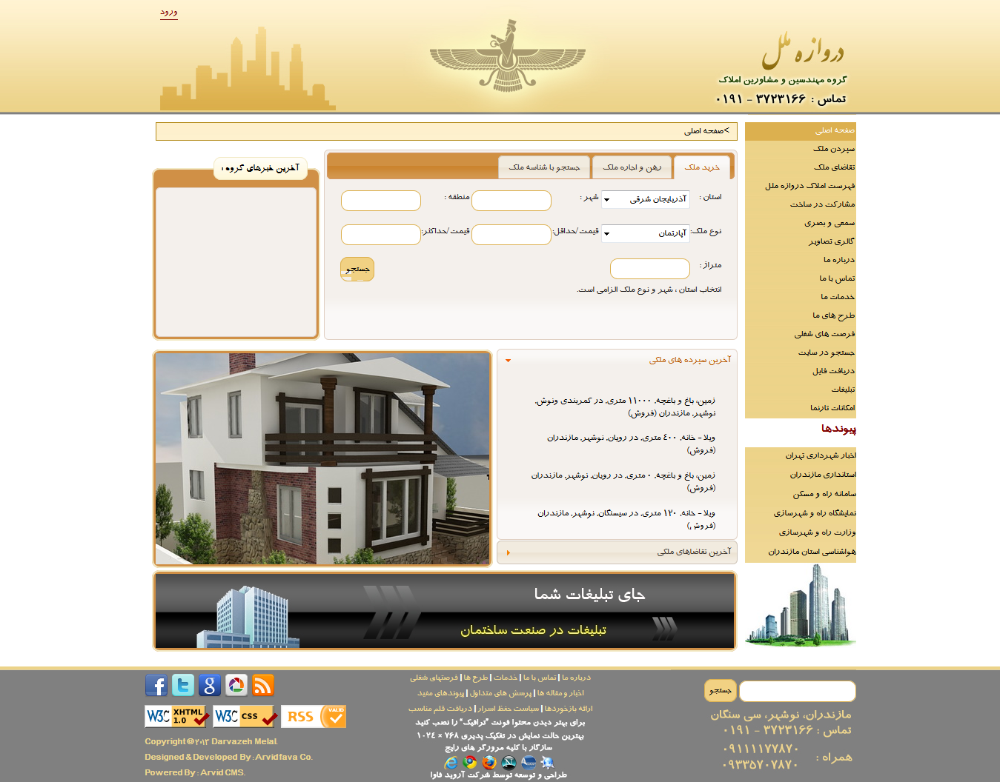

# I've moved

**Project Title**
# Apatite - Real Estate MIS

**Project Status:** Finished, Offline
**Project Date:** March, 2011

**Project Type**
Real Estate MIS Development

**Project Description**
A software system for the business of real estate; the profession of buying, selling, or renting land, buildings or housing. I've designed this web application system for Arvidfava Co ([http://www.Arvidfava.ir](http://www.Arvidfava.ir)). It is open source and you can download it.

**Client**
Arvidfava IT Engineering Company. ([http://www.Arvidfava.ir](http://www.Arvidfava.ir))

**Project Specifications**
* Based on MWPSK CMS ([https://mywebpagesstarterkit.codeplex.com/](https://mywebpagesstarterkit.codeplex.com/)) as a WAF (Web Application Framework)
* .NET Platform
* C# / ASP.NET Web Forms / ASP.NET Web Services
* Based on SMPP v3.4
* Repository Design Pattern
* ADO.NET DA & LINQ
* XML Databases / MS SQL Server 2008 Database
* HTML / CSS / Javascript Front-End Development

Visit My Official Website : [http://www.AliZamani.net](http://www.AliZamani.net)

**Screenshots**
Download Screenshots : [Apatite-Screenshot.rar](Home_Apatite-Screenshot.rar)
## Home Page:

## Property Escrow:
.png)

## Property List:
.png)

## Property Information:
.png)